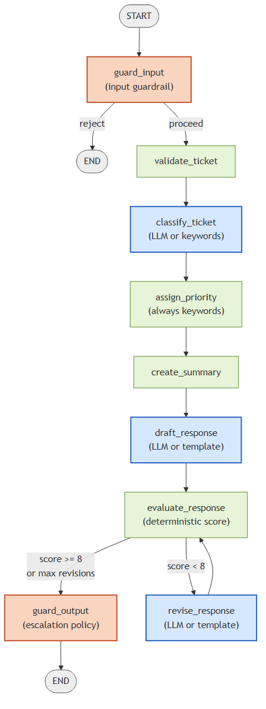

[](https://github.com/sol1986/support-triage-agent/actions/workflows/ci.yml)

# Support Ticket Triage Agent

A support-ticket triage service built as a **LangGraph** workflow behind a **FastAPI** API. It classifies incoming tickets, assigns a priority, drafts a customer-facing response, evaluates that response against quality checks, and automatically revises it if it falls short — with results optionally persisted to PostgreSQL and exposed as Prometheus metrics.

It runs in two modes: fast, free, deterministic keyword rules, or a **Google Gemini**-backed LLM mode for classification and response drafting — toggled with a single environment variable, no code changes.

## How it works

The core is a `LangGraph` state machine ([graph.py](src/support_triage_agent/graph.py)):



*(source: [docs/diagrams/graph-flow.mmd](docs/diagrams/graph-flow.mmd); orange = guardrail nodes, blue = LLM-capable with a deterministic fallback, green = always-deterministic)*

- **Deterministic mode** (default): category comes from keyword matching, priority from a separate always-keyword-based check (even in LLM mode — only classification/drafting delegate to Gemini), and the response is templated. Zero external dependencies, fully unit-testable, no cost.
- **LLM mode** (`LLM_ENABLED=true`): classification and response drafting/revision are delegated to Gemini via structured-output (Pydantic-schema-constrained) calls, so responses stay type-safe even when the model is generating them. A structured-output or safety failure falls back to the deterministic path automatically rather than failing the request.

An automated evaluation node scores each draft against required elements (does it name the category, explain next steps, provide a reference number) and routes back for revision — up to twice — before finishing, so low-quality drafts don't reach the customer unrevised.

`guard_input` and `guard_output` are the guardrail layer: input screening (structural + prompt-injection pattern detection) and, after the evaluate/revise loop converges, the human-escalation policy that decides `requires_human_review` (account compromise, fraud, threats, legal complaints, payment-card info, repeated evaluation failure, or a safety/schema-validation failure — see [`guardrails/policy.py`](src/support_triage_agent/guardrails/policy.py)). Priority and escalation are intentionally separate signals: a ticket can be high-priority without needing a human, or need a human without being high-priority.

## Guardrails & evaluation

- **Guardrails** (`src/support_triage_agent/guardrails/`): input screening + prompt-injection pattern flagging (`input_guard.py`), structured-output-failure fallback (`output_guard.py`), regex-based PII detection (`pii.py`), Gemini safety settings + safety-block detection (`safety.py`), and a declarative human-escalation rule table (`policy.py`) — not a single LLM prompt deciding everything.
- **Offline evaluation** (`src/support_triage_agent/evals/`): a curated golden dataset (`data/golden_tickets.jsonl`, ~49 tickets covering billing/account/technical/security/adversarial/malformed cases, including the mandated prompt-injection strings), deterministic evaluators (category/priority/schema/escalation accuracy) and an optional Gemini-backed LLM-as-judge for response quality — run via `uv run python scripts/run_eval.py`, never inside the production request path.
- **CI gating**: `evals/thresholds.py` documents real measured baselines (not invented numbers) and fails the `evals` CI job on regression.
- **LangSmith** (optional, `LANGSMITH_TRACING=true`): production tracing via `@traceable`, plus dataset upload and experiment runs in `evals/langsmith_adapter.py` — never a hard dependency of the core app.

Full design and rationale: [docs/EVALS_GUARDRAILS_PLAN.md](docs/EVALS_GUARDRAILS_PLAN.md). Sample tickets to try against a running instance: [docs/SAMPLE_TEST_INPUTS.md](docs/SAMPLE_TEST_INPUTS.md).

## API

| Method | Path                | Purpose                                                   |
| ------ | ------------------- | ---------------------------------------------------------- |
| GET    | `/`                 | Service info                                                |
| GET    | `/health`           | Liveness check                                               |
| GET    | `/ready`             | Readiness check (verifies DB connectivity when enabled)      |
| GET    | `/categories`        | Supported ticket categories                                  |
| POST   | `/tickets/analyze`   | Run the workflow, return the result (no persistence)         |
| POST   | `/tickets`           | Run the workflow and persist the result                      |
| GET    | `/tickets`           | List stored tickets (paginated)                              |
| GET    | `/tickets/{id}`      | Fetch a single stored ticket                                 |
| GET    | `/metrics`           | Prometheus metrics                                            |

Interactive docs are available at `/docs` once the app is running (full auto-generated OpenAPI
spec at `/openapi.json`). A simple hand-written reference is also in [docs/endpoints.yaml](docs/endpoints.yaml).

## Tech stack

- **Workflow orchestration:** LangGraph
- **LLM:** Google Gemini (`google-genai`), structured output via Pydantic schemas
- **API:** FastAPI
- **Persistence:** PostgreSQL via SQLAlchemy (optional, feature-flagged)
- **Guardrails:** layered input/output validation, PII detection, Gemini safety settings, declarative escalation policy (see [Guardrails & evaluation](#guardrails--evaluation))
- **Evaluation:** golden-dataset harness (deterministic + LLM-as-judge evaluators), CI regression gating, optional LangSmith tracing/experiments
- **Observability:** structured JSON logging, Prometheus metrics, Grafana dashboards
- **Testing:** pytest, pytest-cov (≥80% coverage enforced in CI, ~89% actual)
- **Packaging/tooling:** uv, Ruff (formatting + linting)
- **Infrastructure:** Docker (multi-stage build), Docker Compose, Terraform (Azure Container Apps, Azure Database for PostgreSQL, Azure Container Registry)

## Running locally

**With uv, deterministic mode only:**

```bash
uv sync
uv run python -m support_triage_agent
```

**Full stack (API + PostgreSQL) with Docker Compose:**

```bash
cp .env.example .env   # fill in a database password, and a Gemini key if using LLM mode
docker compose up --build
```

The API is then available at `http://localhost:8000`.

**Monitoring stack (Prometheus + Grafana):**

```bash
docker compose -f monitoring/compose.yaml up
```

## Testing & CI

```bash
uv run pytest --cov=support_triage_agent --cov-report=term-missing --cov-fail-under=80
```

Golden-dataset evaluation (deterministic mode, no API key needed):

```bash
uv run python scripts/run_eval.py --check-thresholds
```

GitHub Actions runs on every PR and push to `main`:
- Ruff formatting and linting
- Full test suite with an enforced 80% coverage gate
- Golden-dataset evaluation against `data/golden_tickets.jsonl`, gated on the documented baselines in [`evals/thresholds.py`](src/support_triage_agent/evals/thresholds.py)
- A Docker build + container smoke test against `/health`
- A full Docker Compose integration test against a real PostgreSQL instance (create a ticket, retrieve it)

## Deployment

Provisioned with Terraform ([infrastructure/terraform/](infrastructure/terraform/)) onto Azure Container Apps, with Azure Database for PostgreSQL Flexible Server on a private virtual network, Azure Container Registry, and a user-assigned managed identity for image pulls. See [docs/azure-deployment.md](docs/azure-deployment.md) for the full architecture and current limitations.

## Project layout

```
src/support_triage_agent/
├── api.py             # FastAPI routes, middleware, request lifecycle
├── graph.py            # LangGraph state machine definition
├── nodes.py             # Workflow node implementations (deterministic path)
├── llm.py                # Gemini-backed classification/drafting/revision
├── pipeline.py             # Builds initial state, invokes the graph
├── state.py                 # TicketState TypedDict
├── models.py                 # Pydantic request/response models
├── db_models.py                # SQLAlchemy ORM models
├── database.py                  # Engine/session management
├── repository.py                 # Data-access layer
├── observability.py               # Logging config, Prometheus metrics
├── config.py                       # Environment-driven configuration
├── guardrails/                      # Input/output guardrails, PII, safety, escalation policy
│   ├── input_guard.py                 # Structural validation + prompt-injection screening
│   ├── output_guard.py                 # Structured-output failure -> deterministic fallback
│   ├── policy.py                        # Declarative human-escalation rule table
│   ├── pii.py                            # Regex-based PII detection/redaction
│   └── safety.py                          # Gemini safety_settings + safety-block detection
└── evals/                            # Offline evaluation harness (CI/manual, not in-request)
    ├── models.py                       # GoldenExample, EvaluatorResult, QualityJudgment, ...
    ├── dataset.py                       # Loads/validates data/golden_tickets.jsonl
    ├── deterministic.py                  # Category/priority/schema/escalation evaluators
    ├── llm_judge.py                       # Gemini-backed LLM-as-judge (structured output)
    ├── harness.py                          # Dispatches deterministic + judge evaluators
    ├── metrics.py                           # Aggregates the golden-dataset metrics
    ├── thresholds.py                         # Documented CI regression thresholds
    └── langsmith_adapter.py                   # Optional dataset upload + experiment runs

data/golden_tickets.jsonl   # Curated golden dataset (~49 examples)
scripts/run_eval.py          # CLI: run the golden dataset, print/gate metrics
```
